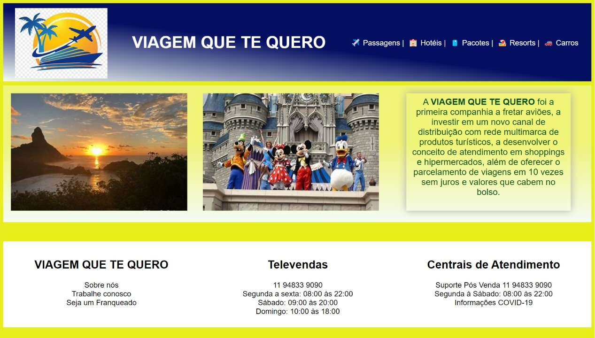

<h1>
    Landing page em 🚧
</h1>

        
    

 
<h1>
    

        <a style="font-size: 20px" href="https://viagempraquetequero.netlify.app/" target="_blank"> Veja o Site</a>
    

</h1>

<h2> 💻 Projeto </h2>

Este projeto consiste em uma landing page bem simples para uma empresa de Agência de Viagens, _VIAGEM PRA QUE TE QUERO_.

 
<h1>

<h2> 📈 Conhecimento adquirido </h2>

* Utilização de cores (linear gradiente);
* Utilização float para direcionar elemento dentro do CSS;
* Responsividade utilizando @Media;

 

<h2> 🛠 Tecnologias usadas </h2>

O projeto foi desenvolvido utilizando as seguintes tecnologias:

- [HTML](https://www.w3schools.com/html/)
- [CSS](https://www.w3schools.com/css/)

 
 

 Desenvolvido com 💜 por Leandro Pereira ✌🏽 

 

<a href="./README.md"><< Voltar</a>

